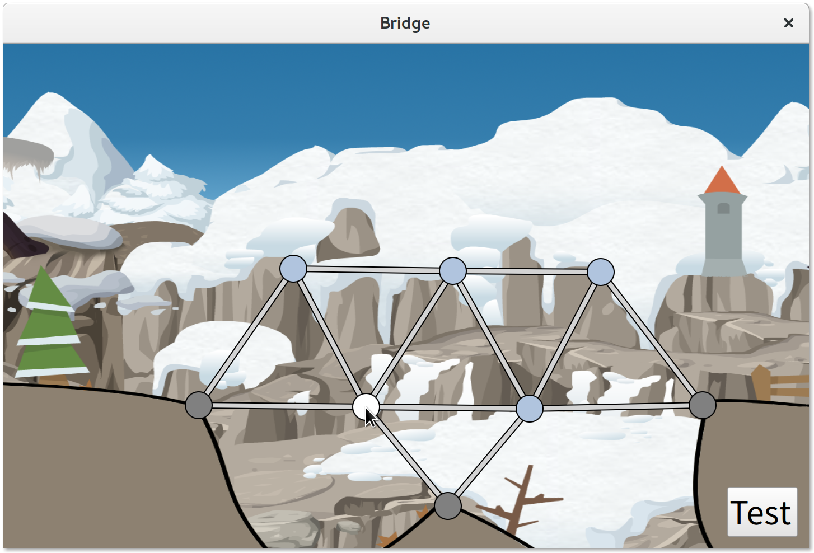

# Kongoni Bridge
A bridge-building game made for [Ludum Dare 36][1]

## How to Build
Compiling from source requires cmake, qt5 and a compiler that supports C++14.

    cmake -H. -Bbuild && cmake --build build

[1]: http://ludumdare.com/compo/ludum-dare-36/?action=preview&uid=57468
